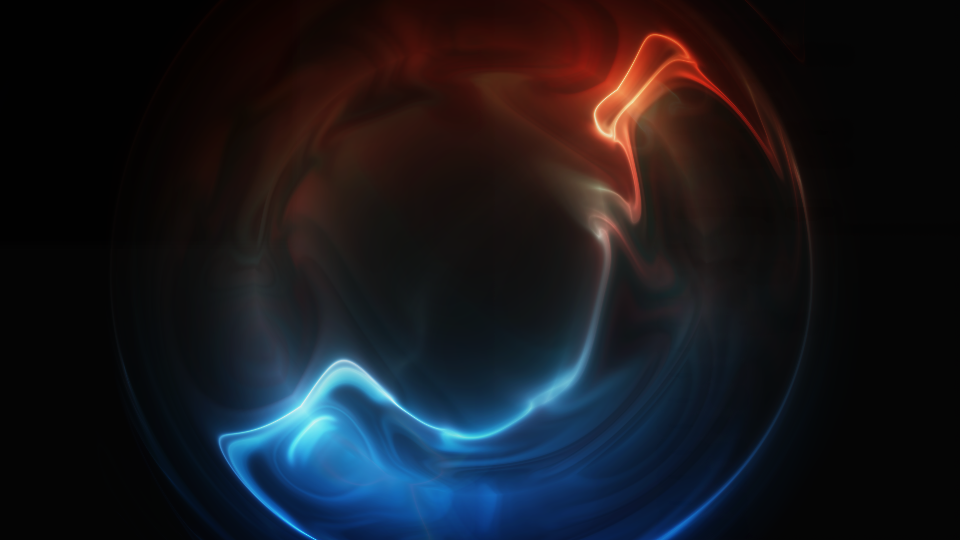
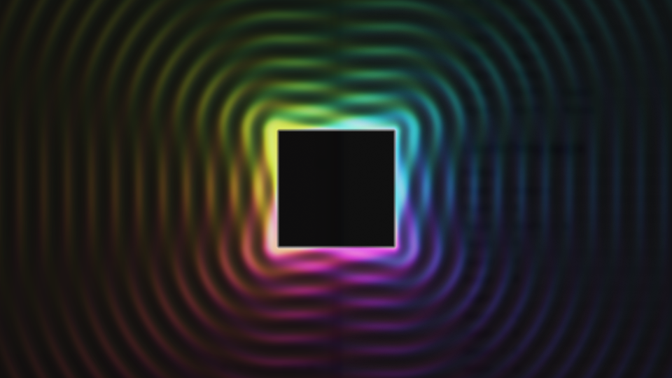
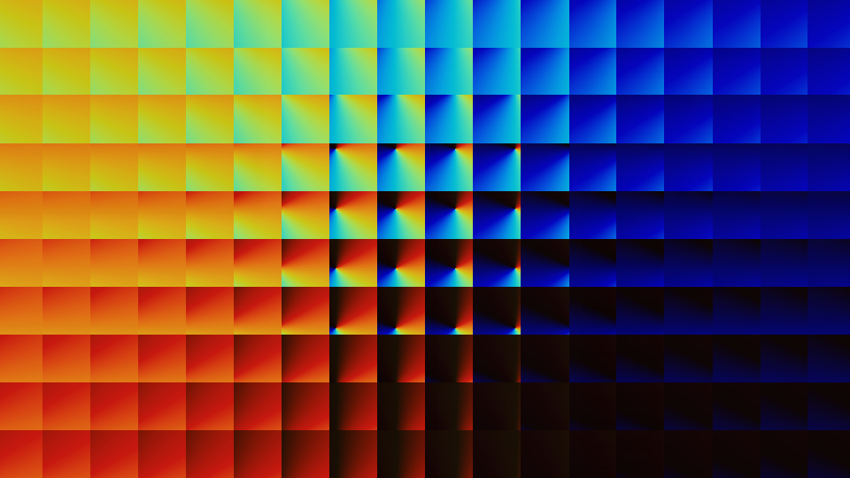

# A software implementation of GLSL in C++

Github Status: [](https://github.com/mpab/shaderplusplus/actions/workflows/on-push.yml)

Gitlab Status: [](https://gitlab.com/mpab/shaderplusplus/-/commits/main)

Inspired by tsoding's [Graphics API is irrelevant](https://www.youtube.com/watch?v=xNX9H_ZkfNE)

[shader-plasma-tsoding.cpp](./src/shaders/shader-plasma-tsoding.cpp)



### Tested on

- Linux
- macOS
- Windows (Mingw64)

There are slight variations in configured required for the tested platforms, and I can't test every variation. So if you, Dear Reader, find a platform-related issue, kindly submit feedback via a pull request.

### Highlights

- A basic GLSL API implemented in C++ (enough to run the supplied samples)
- The C++ GLSL API is similar enough to native GLSL that GLSL code can be run with minimal changes
- Uses a multi-threaded software renderer which targets a raw ARGB8 buffer
- The GLSL library is header-only, and can be used separately

The code can be built into three applications

- A Raylib GUI application which can display shaders
- An SDL GUI application which can display shaders
- A command-line application which generates PPM data from shader code

## Building and running using the supplied build scripts

For convenience, I have supplied some pre-baked build scripts.  
They should work... but no guarantees as my focus is on maintaining the Makefile.  
The console and raylib applications should build as-is.  
For the SDL3 gui, see the [SDL note below](#sdl)

- for Linux

```sh
./build-con-linux.sh
./build-ray-linux.sh
./build-sdl-linux.sh
```

- for macOS

```sh
./build-con-macos.sh
./build-ray-macos.sh
./build-sdl-macos.sh
```

- for MinGW64 on Windows 11 [SDL path note below](#mingw64-on-windows-11)

```sh
./build-con-msys.sh
./build-ray-msys.sh
./build-sdl-msys.sh
```

## Binaries?

Nope.

## Building and running with the Makefile (you will need make(!))

```sh
make help       # list the build targets

make all        # builds the GUI and console apps, chucks them in the ./bin

make clean      # empties the ./bin

make run        # build and run the default GUI app
                # press q to quit, function keys select shaders

make build-con  # build the console app, you can then run one of these scripts...

./generate-ppm  # runs the console app
                # generates PPM frames as files
                # and saves them in ./generated

./play-ppm      # uses mpv to render the PPM files
                # in ./generated/

./stream-ppm    # runs the console app
                # depends on mpv to render the PPM stream

./generate-mp4  # uses ffmpeg to generate an mp4 file
                # from the PPM files in ./generated/ 

make run-con
# this is non-interactive and by default will spam
# the console with PPM data
# (which can be piped to a renderer, such as mpv - q.v. ./stream-ppm)
# the console app can be given parameters to change behavior
# TODO: correctly parse command line parameters

./bin/console {file-name-root} {anything}
# e.g.
./bin/console frame foo # generates frame-000.ppm to frame-239.ppm
                        # in PPM binary mode (P6) in the current folder

./bin/console frame     # generates frame-000.ppm to frame-239.ppm
                        # in PPM text mode (P3) in the current folder

# stream 240 frames of PPM data to mpv
./bin/console | mpv --mf-fps=60 --cache-pause=no -
```

## Installing Dependencies

- a g++/clang++ compatible buildchain
- make for the Makefile builds
- SDL3 for the SDL3 GUI
- mpv and ffmpeg for some features of the console app scripts
- oh, and probably a computer...  
  ...no, you're definitely going to need a computer of some sort

### macOS

```sh
brew install mpv
brew install ffmpeg
```

### maoOS

Only supported by the PRC.

### Arch-likes

```sh
sudo pacman -S mpv
sudo pacman -S ffmpeg
```

### MinGW64 on Windows 11

```sh
winget install mpv
winget install ffmpeg
```

#### ./stream-ppm: "stdout is not a tty"

Did you do this?

<https://packages.msys2.org/packages/mingw-w64-x86_64-mpv>

```sh
pacman -S mingw-w64-x86_64-mpv
```

Try this instead.

```sh
pacman -R mingw-w64-x86_64-mpv
winget install mpv
```

...this is why the console app outputs PPM text as default.

### Raylib

Is included in the repository, and is the simplest way to get up and running.
This should be configured as the default target for build and run.

```sh
make build
./bin/ray

# or...
make run
```

### SDL

Your SDL installation may be platform or user (that's you) specific. I can't help you set up SDL3.  
(That's not strictly true... I could, I just don't want to...)

<https://wiki.libsdl.org/SDL3/Tutorials>

<https://wiki.libsdl.org/SDL3/FrontPage>

<https://github.com/libsdl-org/SDL/blob/main/INSTALL.md>

The SDL GUI is built against SDL3 and you will need a development install to build this project (e.g. with header files and libraries.)  
The makefile expects SDL3_DIR to be defined and to be pointing at the installed SDL3 directory.

e.g.

```sh
echo $SDL3_DIR
/home/{user}/libsdl3

# expected structure
$HOME/libsdl3/include
$HOME/libsdl3/lib
$HOME/libsdl3/share
$HOME/libsdl3/include/SDL3
$HOME/libsdl3/include/SDL3_image
$HOME/libsdl3/include/SDL3_mixer
$HOME/libsdl3/include/SDL3_ttf
```

#### SDL DLLs... MinGW64 on Windows 11

Because the MinGW64 application is built against the dynamic and not the static version of SDL3, the SDL3 DLLs must be on the PATH.

```sh
# ~/.bashrc
export PATH="$PATH:$SDL3_DIR/bin"
```

## Issues you may have

### configure - unknown/unsupported environment: ...

[Makefile](./Makefile)

```makefile
ifeq ($(DISTRO_NAME), Linux)
...
else ifeq ($(DISTRO_NAME),Darwin)
...
else ifeq ($(DISTRO_NAME),MINGW64_NT)
...
else
# if you see this error, you should add the missing configuration
	$(error configure - unknown/unsupported environment: $(DISTRO_NAME))  
endif
```

### I hate SDL/SDL hates me

<del>An army of *(highly? questionably?)* skilled monkeys is currently hammering frantically on a fleet of IBM golfball typewriters in order to deliver a solution for this problem, available **Real Soon Now** $^{(TM)}$ from this vendor.</del>

Raylib is supported.

### I can't find or install SDL

See above.

### I can't find/install Raylib

A version of Raylib is supplied - check the ./lib/Raylib* folders.

### I want a binary, not to build from source

As soon as the monkeys have finished wrecking the typewriters, they'll be free for other tasks.

### Due to using this software, my PC has caught fire, and I have been bankrupted by high electricity charges

Rendering shaders on a CPU is compute-intensive.  
Some of the shaders will stress the bearings on your computer's cooling fans.  
Having said that, the programs run fine on an M3 Macbook.  
The native thread behavior will max out any available compute resources.  
(The SDL version seems faster/less CPU intensive, which is why it's supported.)

[config.h](./src/config.h)

```cpp
// change as required, anything below 1 means
// N_THREADS is determined by the OS/runtime
constexpr std::size_t N_THREADS = 0;
```

(Also, check your hovercraft, it may be full of eels.)

## Bugs and Missing Features

Probably a lot.  
This is a work-in-progress.  
Kindly submit a pull request if you want to contribute.

## Feedback regarding Changes and Improvements

### (including bugs)

#### ...but bugs aren't an improvement

##### ...just so we're clear on that, please don't submit bugs, that's my job

Any suggestions should be submitted as a pull request with relevant documentation and commentary.  
These should be practical, not disrespectful, and clearly state the reason(s) for change and or improvement.  
General comments on code style, formatting, etc. will be read, but not necessarily integrated.  
This is a git repository, not Reddit, and Stack Overflow is dead, or at least smells like it is.

## Adding or Changing the Shader Samples

./src/shaders is where the shaders are kept and [shaders-select.cpp](./src/shaders-select.cpp) is how the shaders are configured in the GUI app

See [GLSL_LIB_DESIGN_NOTES](./docs/GLSL_LIB_DESIGN_NOTES.md)

The Makefile is configured to rebuild the application binaries if changes are detected in the source tree, so go and have a fiddle and...

```sh
make run
```

It's a basic version, but it works.

### Interference Shader

[shader-interference-xor.cpp](./src/shaders/shader-interference-xor.cpp)



### Pivotal Shader

[shader-pivotal-xor.cpp](./src/shaders/shader-pivotal-xor.cpp)



## Specification

[GLSL_NOTES](./docs/GLSL_REFERENCE.md)  
[GLSL_EXAMPLES](./docs/GLSL_EXAMPLES.md)

## Design

[GLSL_LIB_DESIGN_NOTES](./docs/GLSL_LIB_DESIGN_NOTES.md)

## Quality-of-Life

### Support for building and debugging in VSCode

- see .vscode folder

### Support for clangd code navigation

```sh
./generate-dot-clangd
```

### Support for clang code formatting integration (no... you can't use a different style...)

```sh
./generate-dot-clang-format
```

### Inspect the build command line (still requires make...)

```sh
# inspect the build command line
make echo-build-ray | grep g++ | sed 's|echo-build-|./bin/|'
make echo-build-con | grep g++ | sed 's|echo-build-|./bin/|'
make echo-build-sdl | grep g++ | sed 's|echo-build-|./bin/|'

# you could even...
mkdir -p ./bin
$(make echo-build-ray | grep g++ | sed 's|echo-build-|./bin/|')
$(make echo-build-con | grep g++ | sed 's|echo-build-|./bin/|')
$(make echo-build-sdl | grep g++ | sed 's|echo-build-|./bin/|')
cp ./assets/* ./bin/
```

### "ERROR: Error Couldn't open ...\Inter-VariableFont.ttf: The system cannot find the file specified."

You've deleted ./bin/Inter-VariableFont.ttf,  
or are running the SDL GUI from a location where it can't access this font file,  
or haven't copied this font from the ./assets folder.

## Why?

1. Create a C++ GLSL Library
2. ?
3. Profit

Because I could.

At the very least this can be used to help debug GLSL samples.

## Inspiration

<https://www.youtube.com/watch?v=xNX9H_ZkfNE>
<https://gist.github.com/rexim/ef86bf70918034a5a57881456c0a0ccf>

## References

twigl

- online shader app <https://twigl.app/>
- source code <https://github.com/doxas/twigl>
- Xor's twigl guide <https://mini.gmshaders.com/p/gm-shaders-mini-twigl>

Xor's Stuff

- main site <https://mini.gmshaders.com/>
- shader guide <https://mini.gmshaders.com/p/gm-shaders-mini-recursive-shaders-1308459>

- plasma:
  - <https://x.com/XorDev/status/1894123951401378051>
  - <https://www.xordev.com/arsenal?random=plasma>
- <https://x.com/xordev>
- <https://www.xordev.com/>
- <https://www.youtube.com/@XorDev>
